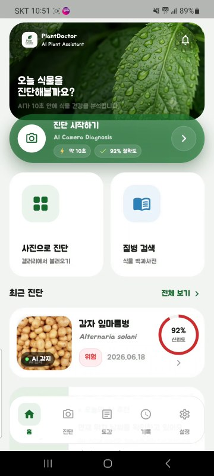
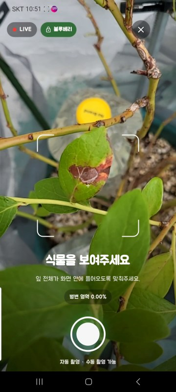
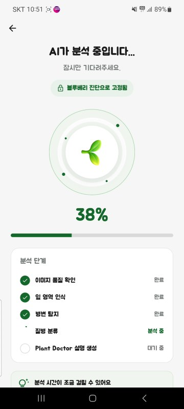
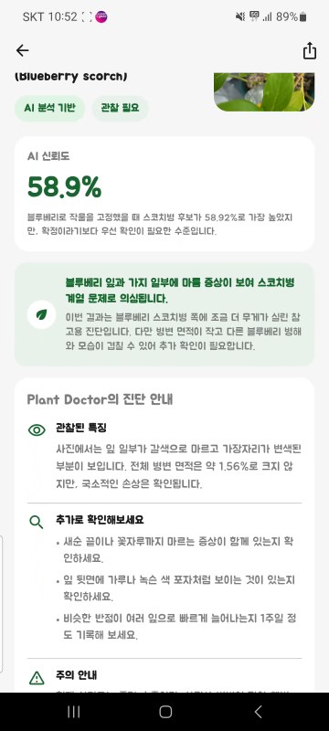
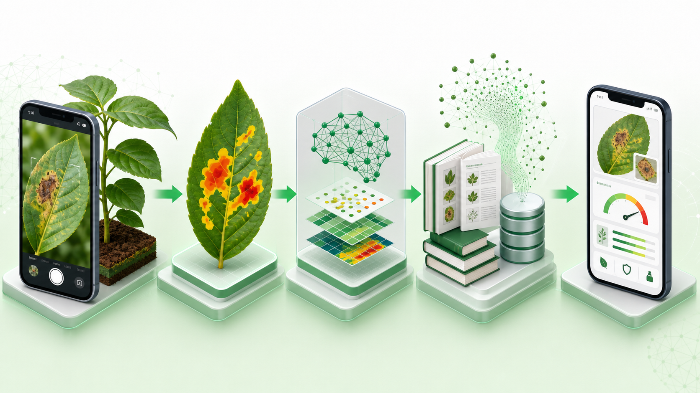
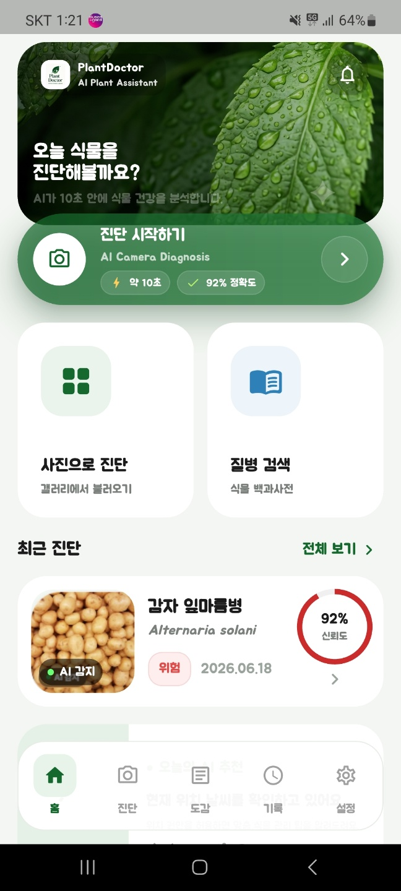
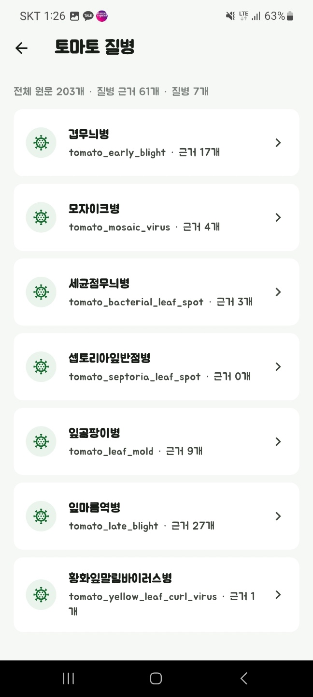
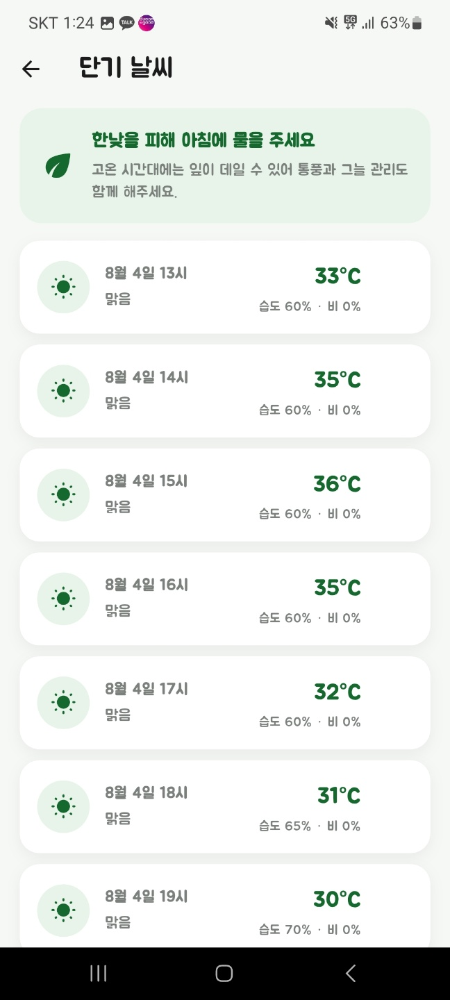

# 잎파라치 — AI 식물 질병 진단 시스템

> 컴퓨터 비전 기반 식물 질병 진단부터 RAG 기반 설명 생성, FastAPI 추론 서버, Flutter 모바일 앱까지 직접 구축한 End-to-End AI 서비스 프로젝트

이 저장소는 데이터 조사부터 모델 학습, RAG 구축, FastAPI 서버, Flutter 앱까지 **혼자 설계하고 구현한 개인 프로젝트**를 포트폴리오 형태로 정리한 것입니다. 발표자료의 역할 분담 표는 초기 공모 문서의 형식이며, 이 저장소에 정리한 개발 작업은 모두 개인 수행 내용입니다.

## 시연 영상

[▶ 약 61초 전체 시연영상 바로 보기 (MP4, 28.3MB)](https://raw.githubusercontent.com/Engineer3rd-Class-Kimmin/Plant_Doctor/main/assets/demo/plant-doctor-demo.mp4)

| 앱 실행 | 실시간 촬영 | AI 분석 | 근거 기반 결과 |
|---|---|---|---|
|  |  |  |  |

## 기술 스택

| 영역 | 기술 |
|---|---|
| AI / Vision | Python · PyTorch · SegFormer-B3 · ConvNeXt-Small · Transformers |
| RAG / LLM | multilingual-e5-base · BGE Reranker · OpenAI API · NumPy Vector Search |
| Backend | FastAPI · Uvicorn · Pillow/HEIF |
| Mobile | Flutter · Dart · Android |
| Evaluation | Dice · IoU · Recall · Top-1 · Top-3 · Macro Recall · provenance audit |



## 한눈에 보기

```text
카메라/갤러리 이미지
        ↓
SegFormer-B3 (병변 분할)
        ↓ 병변 crop + mask
ConvNeXt-Small (질병 후보 분류)
        ↓ host-constrained 후보
Vector RAG (공공 농업 근거 검색)
        ↓ 근거와 출처
GPT 기반 구조화·검증
        ↓
Flutter 앱 결과 화면
```

| 구분 | 구현 내용 |
|---|---|
| 대상 | 24개 작물 범위, 62개 질병 분류 클래스 |
| 병변 분할 | SegFormer-B3, 병변/배경 이진 분할 |
| 질병 분류 | ConvNeXt-Small, 작물(host) 제약 후보 검색 |
| 지식 검색 | multilingual-e5-base, 38,697개 768차원 정규화 벡터 |
| 생성·검증 | 검색 근거 기반 2단계 LLM 생성, 필드·인용 검사 및 재생성 |
| 서비스 | FastAPI 서버 + Flutter Android 앱 |
| 부가 기능 | 실시간 마스크, 사진 진단, 질병 사전, 날씨·농업 가이드, 다국어 UI |

## 최종 모델 성능

| 모델 | 평가 지표 | 결과 |
|---|---|---:|
| SegFormer-B3 | Dice | **80.26%** |
| SegFormer-B3 | IoU | **67.03%** |
| SegFormer-B3 | Recall | **82.65%** |
| ConvNeXt-Small | Top-1 Accuracy | **82.72%** |
| ConvNeXt-Small | Top-3 Accuracy | **93.11%** |
| ConvNeXt-Small | Macro Recall | **81.72%** |

SegFormer 수치는 PlantSeg 원본 테스트 기준입니다. 분류기는 best epoch 21 기준입니다. 과거 B2/Tiny 실험은 데이터 구성과 평가 프로토콜이 달라 최종 모델과 직접 비교하지 않았습니다. 세부 조건은 [모델 및 평가](docs/MODEL_EVALUATION.md)를 참고하십시오.

## 문제를 어떻게 풀었는가

1. 전체 잎을 바로 분류하면 배경과 정상 조직이 판단을 방해한다고 보았습니다.
2. 먼저 병변만 분할하고 병변 영역을 중심으로 분류하는 2단계 비전 구조를 만들었습니다.
3. 사진 한 장만으로 확정 진단하는 위험을 줄이기 위해 사용자가 작물을 먼저 선택하도록 했습니다.
4. 분류 확률을 그대로 설명으로 바꾸지 않고, 공공 농업 자료를 벡터 검색한 뒤 근거가 있는 내용만 생성하도록 했습니다.
5. 실내 데이터와 실제 촬영 환경의 차이를 줄이기 위해 회전, 밝기, 역광, 그림자, 블러, 압축 노이즈 등을 대량 증강했습니다.
6. 카메라부터 서버 응답, 결과 화면까지 하나의 앱 흐름으로 통합했습니다.

## 주요 문서

- [개발 과정과 문제 해결](docs/DEVELOPMENT_JOURNEY.md)
- [시스템 아키텍처](docs/ARCHITECTURE.md)
- [RAG 구축 방식](docs/RAG_PIPELINE.md)
- [데이터와 모델 평가](docs/MODEL_EVALUATION.md)
- [앱·서버 구성과 실행](docs/APP_AND_SERVER.md)
- [제품 가치와 확장 로드맵](docs/PRODUCT_AND_ROADMAP.md)
- [데이터·공개 범위·한계](docs/DATA_AND_LIMITATIONS.md)
- [면접/발표용 질문과 답변](docs/INTERVIEW_QA.md)

## 앱 화면

| 홈 | 질병 사전 | 날씨 가이드 |
|---|---|---|
|  |  |  |

## 저장소 구성

```text
.
├─ README.md
├─ assets/demo/            # Android 실기기 시연영상과 대표 프레임
├─ docs/                 # 설계, 실험, RAG, 회고, 발표용 설명
├─ src/
│  ├─ backend/           # FastAPI 추론·RAG 서버
│  ├─ mobile/            # Flutter 앱의 lib 및 프로젝트 설정
│  └─ research/          # 대표 학습·평가·RAG 구축 스크립트
├─ evidence/             # 재현 가능한 지표·인덱스 메타데이터
└─ assets/               # 포트폴리오 이미지
```

## 로컬 실행

먼저 저장소를 내려받고 백엔드 환경을 준비합니다.

```bash
git clone https://github.com/Engineer3rd-Class-Kimmin/Plant_Doctor.git
cd Plant_Doctor/src/backend
python -m venv .venv
```

Windows PowerShell:

```powershell
.\.venv\Scripts\python.exe -m pip install -r requirements.txt
Copy-Item .env.example .env
.\.venv\Scripts\python.exe -m uvicorn app:app --host 0.0.0.0 --port 8001
```

macOS/Linux:

```bash
./.venv/bin/python -m pip install -r requirements.txt
cp .env.example .env
./.venv/bin/python -m uvicorn app:app --host 0.0.0.0 --port 8001
```

`.env`에서 모델 checkpoint와 RAG 인덱스 경로, API 키를 설정한 뒤 실행해야 합니다. 모델 가중치와 RAG 원문·벡터 본체는 용량 및 데이터 배포 조건 때문에 GitHub에 포함하지 않았으므로, 공개 저장소만 복제한 상태에서는 전체 AI 추론을 재현할 수 없습니다. 필요한 파일 구조는 [.env.example](src/backend/.env.example)에서 확인할 수 있습니다.

서버가 준비되면 다음 주소로 로딩 상태를 확인합니다.

```text
http://127.0.0.1:8001/health
```

PowerShell 실행 정책으로 `Activate.ps1`이 막히더라도 위 예시처럼 가상환경의 `python.exe`를 직접 호출하면 됩니다.

## 공개 저장소 주의사항

- `.env`, API 키, 개인 인증정보는 포함하지 않았습니다.
- 모델 가중치, 원본 데이터셋, RAG 원문/벡터 본체, APK는 포함하지 않았습니다.
- 이 시스템은 의사결정 보조 도구이며 전문가의 현장 진단을 대체하지 않습니다.
- 데이터셋과 공공 자료의 원저작권·이용 조건은 각 제공처에 따릅니다.
- 아직 오픈소스 라이선스를 선택하지 않았습니다. 공개 재사용을 허용하려면 업로드 전에 라이선스를 별도로 선택해야 합니다.

---

**개인 기여 범위:** 문제 정의 · 데이터 분석/정제 · 학습 파이프라인 · 증강 · 모델 평가 · RAG 수집/정제/임베딩/검색 · LLM 검증 흐름 · API · Flutter 앱 · 통합 테스트 · 발표자료 정리
