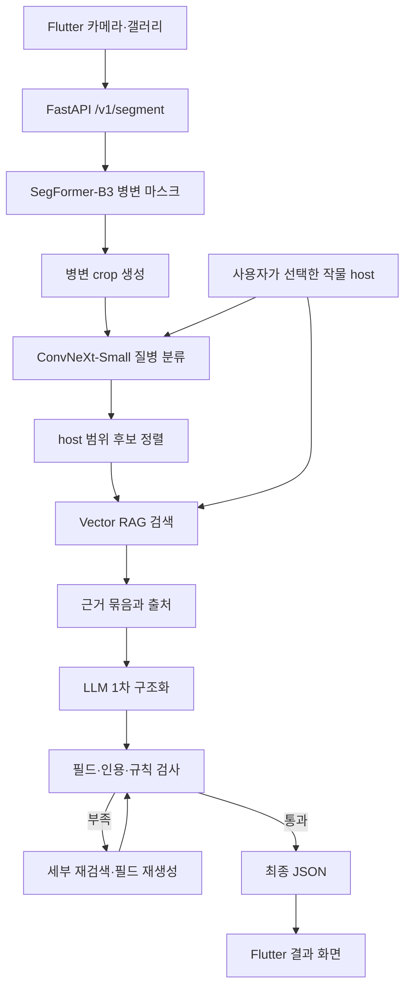

# 시스템 아키텍처

## 설계 목표

단순 이미지 분류 앱이 아니라 다음 세 가지를 동시에 만족시키는 것을 목표로 했습니다.

1. 사진에서 실제 병변 위치를 시각적으로 보여줄 것
2. 사용자가 선택한 작물 범위 안에서 질병 후보를 좁힐 것
3. 최종 설명은 모델의 추측이 아니라 출처가 있는 농업 자료에 근거할 것

## 전체 흐름

## 비전 계층

### 1. 병변 분할

SegFormer-B3를 배경/병변 2개 클래스로 구성했습니다. 분할 모델은 질병명을 결정하지 않고 병든 것으로 보이는 픽셀을 찾습니다. 이 결과는 사용자에게 마스크로 표시되고, 다음 분류기의 입력 영역을 제한하는 데 사용됩니다.

### 2. 질병 분류

ConvNeXt-Small은 병변 중심 이미지를 62개 질병 클래스로 분류합니다. 앱에서 작물을 먼저 선택하게 한 뒤 해당 작물에 가능한 질병만 후보로 남기는 host constraint를 적용했습니다. 이를 통해 서로 다른 작물에서 외형이 비슷한 병을 잘못 추천하는 문제를 줄였습니다.

## 지식 계층

벡터 인덱스는 38,697개 청크를 `intfloat/multilingual-e5-base`로 임베딩한 768차원 L2 정규화 벡터로 구성했습니다. 질의에도 E5 권장 접두사 `query:`를 사용하고, 문서에는 `passage:`와 질병·범주 메타데이터를 붙였습니다. 검색 점수는 정규화 벡터의 내적, 즉 cosine similarity입니다.

연구용 하네스는 목적별 다중 질의, Reciprocal Rank Fusion, BGE reranker, 출처별 최대 개수 제한을 적용했습니다. 모바일 서버는 지연시간을 줄이기 위해 host 일치와 최소 유사도 기준을 먼저 적용하는 단순 top-k 경로를 사용합니다.

## 생성·검증 계층

LLM은 질병을 처음부터 맞히는 모델이 아니라, 비전 모델이 만든 후보와 RAG 근거를 사용해 결과 JSON을 구성하는 역할입니다.

- 1차 생성: 진단명, 핵심 증상, 원인, 관리 방법, 근거 출처를 구조화
- 검사: 필수 필드, 질병/작물 정합성, 인용 여부, 근거 밖 단정 여부 확인
- 보강: 부족한 목적의 근거만 다시 검색
- 부분 재생성: 누락된 필드만 재생성
- 최종 반환: 앱이 바로 렌더링할 수 있는 JSON

초기 실험에서는 로컬 Gemma 계열 모델을 사용했고, 최종 앱 서버에서는 GPT 계열 API를 연결했습니다. 모델을 교체해도 검색과 검증 계층은 유지되도록 분리했습니다.

## 서비스 계층

FastAPI 서버의 주요 경로는 다음과 같습니다.

| API | 역할 |
|---|---|
| `GET /health` | 모델·RAG·CUDA 로딩 상태 확인 |
| `POST /v1/segment` | 병변 마스크 생성 |
| `POST /v1/diagnose` | 분할·분류·검색·설명 통합 진단 |
| `GET /v1/dictionary/{host}` | 선택 작물의 질병 목록 |
| `GET /v1/dictionary/{host}/{disease_id}` | 질병 상세 정보 |
| `GET /v1/localize` | 정적 다국어 문자열 제공 |

## 실패와 대체 경로

- 병변 면적이 너무 작거나 없으면 무리하게 진단하지 않고 촬영 재시도를 안내합니다.
- RAG 최소 점수 또는 host 일치 조건을 통과하지 못하면 근거가 불충분한 것으로 처리합니다.
- LLM 출력이 JSON 형식이나 필수 필드를 만족하지 않으면 재생성합니다.
- 서버 접근 실패 시 앱에서 HTTP 상태와 연결 오류를 구분해 표시합니다.
- `/` 경로는 서비스 엔드포인트가 아니므로 404가 정상일 수 있습니다. 상태 확인은 `/health`를 사용합니다.
